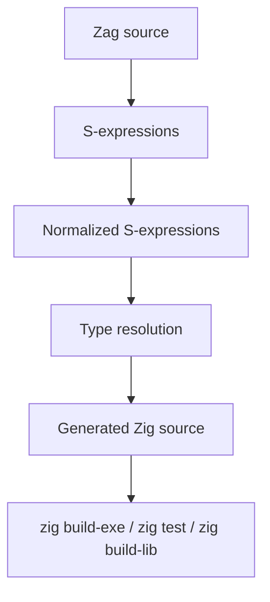
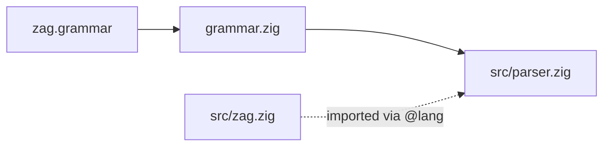

# Zag Architecture

## Thesis

`Zag` is a systems language with elegant syntax and an intentionally pragmatic backend story: target `Zig` first, not because `Zig` is the final destination, but because it gives `Zag` a credible path to native output immediately.

The first version should keep the semantic layer thin. The goal is not to out-Zig `Zig`; the goal is to prove that systems programming can feel much cleaner at the source level without sacrificing explicit meaning or native performance.

Just as importantly, `Zag` should preserve the ethos of `rip-lang` without copying its syntax literally. The continuity should come from language feel: whitespace-sensitive structure, succinct forms, value-oriented expressions, and a bias against boilerplate when the meaning is already clear.

That continuity stops at JavaScript-specific semantics. Systems `Zag` should not inherit UI or reactivity constructs like `component`, `render`, `:=`, `~=`, or `~>`. Module/import boundaries should instead align with the Zig ecosystem.

However, a small core language does not mean a barren one. `Zag` should support optional capability packs that can inject well-chosen runtime or standard-library substrate when needed. Regex support is a good example: the language can enable a high-performance regex facility without making regex engine implementation part of the language core.

## Initial Pipeline



## Grammar Engine

The first two stages of the pipeline (Zag source to S-expressions) are driven by a grammar-based toolchain. A single `.grammar` file defines both the lexer and parser, and a language-agnostic engine generates the parser module from it.

### File Roles

| File | Role |
|------|------|
| `zag.grammar` | Single source of truth: lexer tokens, parser rules, directives |
| `src/grammar.zig` | Language-agnostic engine: reads `.grammar`, generates `parser.zig` |
| `src/zag.zig` | Language module: `Tag` enum, keyword lookup, rewriter |
| `src/parser.zig` | Auto-generated lexer + SLR(1) parser (never hand-edit) |
| `src/compiler.zig` | S-expression to Zig source emitter (Tag-based dispatch) |
| `src/main.zig` | CLI driver: parse, compile, run, tokens |

### Generation Flow



The grammar file sits at the repo root as `zag.grammar`. Running the grammar tool reads it and writes `src/parser.zig`. The generated parser imports `src/zag.zig` via the `@lang = "zag"` directive, which wires in language-specific helpers without putting any Zag knowledge into the engine itself.

The same `grammar.zig` engine is used across projects. Only the grammar file and language module change between languages.

### Grammar Directives

The `@parser` section of the grammar file supports these directives:

| Directive | Purpose |
|-----------|---------|
| `@lang` | Import a language module (`zag.zig`) for keyword/tag support |
| `@as` | Context-sensitive keyword promotion from identifiers |
| `@infix` | Auto-generate operator precedence chain from a declarative table |
| `@conflicts` | Declare expected number of parser conflicts (currently 18) |
| `@code` | Inject raw Zig at specific locations in the output |

The grammar DSL uses indentation-based blocks (`state`, `after`, `tokens`, `@infix`) with no braces or brackets. Rules use `L(X)` for comma-separated lists, `_` for nil, `...N` for spread, and `key:N` for schema documentation. `@infix` can be referenced directly in rules (e.g., `expr = ... | @infix`).

### Language Module Contract

The `@lang` module (`src/zag.zig`) provides three things:

1. **`Tag` enum** -- semantic node types for S-expression output (`module`, `fun`, `sub`, `call`, `if`, operator tags, etc.)
2. **`keyword_as()`** -- maps identifier text to keyword IDs so the parser can promote `"fun"` to the `FUN` terminal when the parse state expects it
3. **Rewriter** -- sits between the generated `BaseLexer` and the parser, handling indentation tracking (indent/outdent tokens), type annotation passthrough, and duplicate newline suppression

### Current Grammar (56 rules)

```
program  body  stmt  decl  defn  block
fun  sub  use  typedef  test  enum  errors  struct
members  member  field  params  returns  type
expr  cond  if  while  for  match  arms
pattern_atom  pattern  arm
suffix_if  coalesce  catch
return  break  continue
defer  errdefer  comptime  inline
assign  const
unary  call  args  term  atom  record  pair  lambda
```

Key grammar features: `body` uses NEWLINE as separator (not terminator); `block` is `INDENT body OUTDENT`; `L(X)` handles comma-separated lists; `decl`/`defn` provides stackable modifiers; `members`/`member` shared by enum, struct, and error; `if` works in both prefix and postfix position; `pattern` nonterminal supports range and enum patterns in match arms; `term` nonterminal enables prefix negation in implicit calls; 18 audited conflicts (dangling else × 8, typed binding, labeled break/continue × 2, postfix-if on return/break/continue × 6, args vs "}").

### Build Commands

```bash
zig build grammar                            # build the grammar tool
./bin/grammar zag.grammar src/parser.zig     # generate parser from grammar
zig build                                    # build the zag compiler
./bin/zag test/examples/hello.zag             # parse and print S-expressions
./bin/zag --compile test/examples/hello.zag   # emit Zig source
./bin/zag --run test/examples/hello.zag       # compile and run end-to-end
./bin/zag --tokens test/examples/hello.zag    # dump token stream
```

## Stage Boundaries

### 1. Zag Source

This is the user-facing language:

- indentation-sensitive
- no semicolons
- expression-friendly
- value-oriented when forms are used as values
- module structure aligned with Zig rather than JavaScript
- optional capability packs for non-core facilities
- explicit enough for systems programming

The source language is allowed to be pleasant. It does not need to look like the eventual target language.

### 2. S-expressions

The parser should produce S-expressions directly instead of a separate AST layer. That makes the compiler operate on uniform structure from the beginning.

This layer should preserve:

- lexical structure
- symbol names
- literal forms
- source spans for diagnostics

At this stage, the representation may still be close to the original surface syntax.

The important point is that this should be a real first-pass representation, not a temporary pseudo-AST that later gets converted into S-expressions. `Zag` should parse into raw S-expressions, rewrite those into normalized S-expressions, and continue transforming the same structural form as long as that remains practical.

### 3. Normalized S-expressions

This is the first serious compiler boundary. Surface sugar should be removed here so later stages only work with a small number of canonical forms.

Examples of normalization:

- alternate declaration sugar becomes one declaration form
- expression sugar becomes explicit calls or bindings
- control-flow shorthand becomes canonical `if`, `while`, or block forms
- value-yielding forms become explicit in the canonical representation

The point is not to make the program low-level yet. The point is to make it structurally regular.

This also means the rewrite pipeline can stay simple:

- parse into raw S-expressions
- rewrite into normalized S-expressions
- keep rewriting S-expressions until a stronger IR is clearly needed

### 4. Type Resolution

Types can be optional in `Zag` source, but they cannot remain optional by the time the compiler emits `Zig`.

This pass should:

- preserve explicit type annotations from source
- infer missing types where the answer is safe and obvious
- propagate resolved types through expressions and bindings
- reject unresolved or ambiguous cases before code generation

The main policy should be:

- infer when safe
- require explicit types at important boundaries
- do not silently guess a "smallest" or "most efficient" type when the choice affects semantics

Likely boundaries that should require explicit types early:

- public definitions
- function parameters in v0
- extern or FFI boundaries
- struct fields and layout-sensitive declarations

### 5. Generated Zig Source

For v0, `Zag` should emit readable `Zig` source and let the Zig compiler own:

- semantic checks that map directly to Zig
- optimization
- machine code generation
- linking
- platform and target details

This is the main leverage move for the project.

Capability packs fit into this stage boundary as well. They should be enabled in source, but they are not primarily grammar or parser features. They are downstream compilation features: the compiler sees that a capability is enabled and injects the supporting Zig modules, imports, helpers, wrappers, or preamble code needed for that capability.

The same kind of contextual rule should apply to value flow more generally, but routine behavior should be anchored at definition time. In the current direction:

- `fun` declares a value-yielding routine
- `sub` declares an effect-oriented routine
- `fun` implicitly yields its final expression by default
- `sub` does not implicitly yield a final value
- a call-site `!` keeps the `rip-lang` meaning of `await`
- a `?` suffix remains part of the actual routine name

Value position versus effect position still matters for forms like `if` and blocks. A form used in value position must yield a value. The same form used only for effect can have its value ignored.

Bindings should also stay low-ceremony. Instead of `let` or `const`, the current direction is:

- plain `=` for normal bindings under scope rules
- `=!` for explicit constant bindings

Optional typing should work similarly to how `rip-lang` evolved, but with an important difference: in `rip-lang`, types can be erased into JavaScript-facing metadata and declarations; in `Zag`, optional source types must eventually become concrete emitted Zig types. So the type pass is not optional, only the source annotations are.

## Capability Packs

The core language should stay small. Optional power should come from explicit capability packs.

Properties of a good capability pack:

- opt-in rather than implicit
- easy to enable and easy to disable
- maps cleanly to generated Zig
- does not distort the core language semantics
- gives access to genuinely useful functionality that would be wasteful to reimplement repeatedly
- is handled downstream of parsing rather than forcing the grammar core to know about every optional facility

Early examples:

- regex support backed by a performant engine or library
- future text/binary utilities
- future platform or FFI helpers

This gives `Zag` a middle ground between a tiny bare language and a bloated everything-in-core design.

The likely first surface syntax for this is `use`, with possible inference from actual use left as a later convenience rather than a v0 requirement.

## Why Not Target Zig Internals

`Zag` should not target actual Zig internal IRs such as `ZIR` in v0.

Reasons:

- Zig internals are not a stable public contract
- the project would become tightly coupled to compiler implementation details
- the fastest path to a working language is emitting Zig source cleanly

`ZIR` can still be a useful architectural inspiration. It should not be the first external dependency boundary.

## Design Principles

- Keep the first implementation narrow.
- Prefer simple lowering over clever semantics.
- Preserve the ethos of succinctness even when the implementation starts conservatively.
- Preserve source spans from the first parsed form onward.
- Only add a dedicated core IR when the compiler starts to outgrow normalized S-expressions.
- Treat `Zig` as the initial ecosystem target, not as a permanent design constraint.
- Exclude JS-specific UI/reactivity features from the systems-language core.
- Use optional capability packs for powerful non-core facilities.
- Target a conflict-free grammar; accept audited conflicts only when clearly justified.
- Keep source types optional, but require full type resolution before Zig emission.

## Likely Evolution

The expected progression is:

1. `Zag -> S-expressions -> normalized S-expressions -> Zig`
2. `Zag -> normalized S-expressions -> typed/core IR -> Zig`
3. `Zag -> typed/core IR -> alternate backend choices`

That sequence keeps the early project honest while preserving room for deeper compiler work later.
